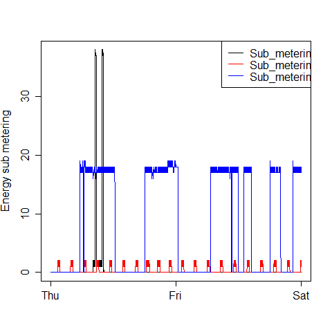
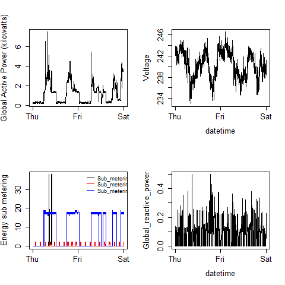

## Author

Timothy Chen Allen 
(Forked from [rdpeng/ExData_Plotting1](https://github.com/rdpeng/ExData_Plotting1/ "rdpeng/ExData_Plotting1") )

## Introduction

This is an analysis of power consumption from 2007-02-01 to
2007-02-02 by a single-family home.  The data are from
the <a href="http://archive.ics.uci.edu/ml/">UC Irvine Machine
Learning Repository</a>, particularly the "Individual household
electric power consumption Data Set":

* <b>Dataset</b>: <a href="https://d396qusza40orc.cloudfront.net/exdata%2Fdata%2Fhousehold_power_consumption.zip">Electric power consumption</a> [20Mb]

* <b>Description</b>: Measurements of electric power consumption in
one household with a one-minute sampling rate over a period of almost
4 years. Different electrical quantities and some sub-metering values
are available.

## Loading the data

* Only the data necessary for analysis were loaded into a 
`data.table` called `consumption`.

* The `Date` field was converted to a `Date` using `as.Date()`.

* A DateTime field was added to `consumption` using the
`as.POSIXct()` function.

* In this dataset missing values are coded as `?`.
These were converted to `NA`.

## Making Plots

This analysis of 2007-02-01 and 2007-02-02 created four total
plots:

### Plot 1

 

### Plot 2

 

### Plot 3

 

### Plot 4

 

