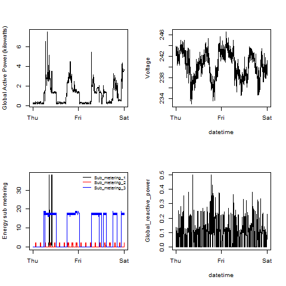

## Author

Timothy Chen Allen 
(Forked from [rdpeng/ExData_Plotting1](https://github.com/rdpeng/ExData_Plotting1/ "rdpeng/ExData_Plotting1") )

## Introduction

This is an analysis of power consumption from 2007-02-01 to
2007-02-02 by a single-family home.  The data are from
the <a href="http://archive.ics.uci.edu/ml/">UC Irvine Machine
Learning Repository</a>, particularly the "Individual household
electric power consumption Data Set":

* <b>Dataset</b>: <a href="https://d396qusza40orc.cloudfront.net/exdata%2Fdata%2Fhousehold_power_consumption.zip">Electric power consumption</a> [20Mb]

* <b>Description</b>: Measurements of electric power consumption in
one household with a one-minute sampling rate over a period of almost
4 years. Different electrical quantities and some sub-metering values
are available.

The following descriptions of the 9 variables in the dataset are taken
from
the <a href="https://archive.ics.uci.edu/ml/datasets/Individual+household+electric+power+consumption">UCI
web site</a>:

<ol>
<li><b>Date</b>: Date in format dd/mm/yyyy </li>
<li><b>Time</b>: time in format hh:mm:ss </li>
<li><b>Global_active_power</b>: household global minute-averaged active power (in kilowatt) </li>
<li><b>Global_reactive_power</b>: household global minute-averaged reactive power (in kilowatt) </li>
<li><b>Voltage</b>: minute-averaged voltage (in volt) </li>
<li><b>Global_intensity</b>: household global minute-averaged current intensity (in ampere) </li>
<li><b>Sub_metering_1</b>: energy sub-metering No. 1 (in watt-hour of active energy). It corresponds to the kitchen, containing mainly a dishwasher, an oven and a microwave (hot plates are not electric but gas powered). </li>
<li><b>Sub_metering_2</b>: energy sub-metering No. 2 (in watt-hour of active energy). It corresponds to the laundry room, containing a washing-machine, a tumble-drier, a refrigerator and a light. </li>
<li><b>Sub_metering_3</b>: energy sub-metering No. 3 (in watt-hour of active energy). It corresponds to an electric water-heater and an air-conditioner.</li>
</ol>

## Loading the data

* Only the data necessary for analysis were loaded into a 
`data.table` called `consumption`.

* The `Date` field was converted to a `Date` using `as.Date()`.

* A DateTime field was added to `consumption` using the
`as.POSIXct()` function.

* In this dataset missing values are coded as `?`.
These were converted to `NA`.

## Making Plots

This analysis of 2007-02-01 and 2007-02-02 created four total
plots:

### Plot 1

 

### Plot 2

 

### Plot 3

 

### Plot 4

 

